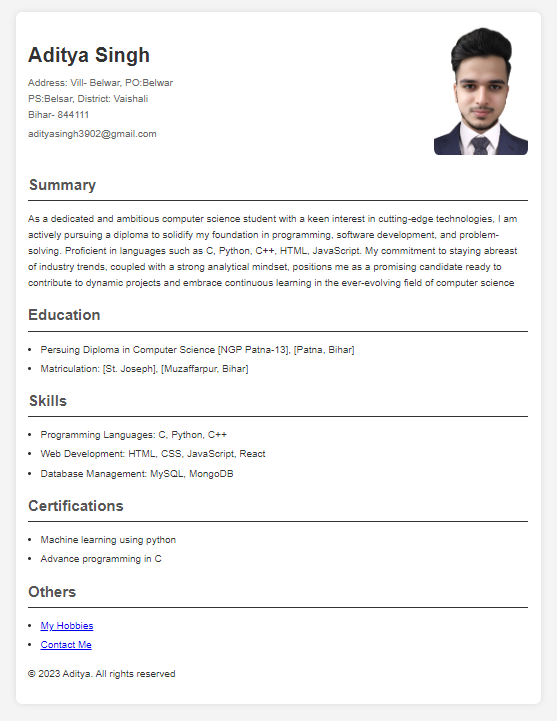

# My Resume

This is my personal resume created using HTML and CSS. You can view it live [here](https://my-resume-ten-psi.vercel.app/).

## Preview



## Features

- Responsive design
- Clean and modern layout
- Easy to update and maintain

## Deployment

This resume is hosted using Vercel. To deploy your own version, follow these steps:

1. Push your changes to the `main` branch:
    ```bash
    git add .
    git commit -m "Initial commit"
    git push origin main
    ```
2. Go to your Vercel dashboard.
3. Add a new project and import the repository from GitHub.
4. Once the project is imported, Vercel will automatically deploy it.

## Contact
- Aditya Singh - adityasingh3902@gmail.com

Project Link: https://github.com/adity3902/Resume